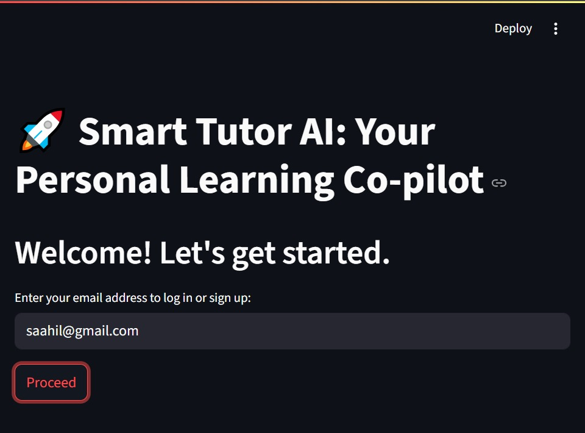

# **Smart Tutor AI: Your Personal Learning Co-Pilot**

**Smart Tutor AI** is a dynamic, multi-agent system designed to provide personalized academic guidance to students. By analyzing performance, learning styles, and career goals, it acts as a 24/7 academic co-pilot, empowering students to take control of their learning journey. This project is developed by **The Learning Stack** team from **Xavier Institute of Engineering, Mumbai**, as part of the **IBM** SkillsBuild **Program**.

This project directly contributes to **UNICEF's Sustainable Development Goal 4: Quality Education**.

## **Key Features**

* **Personalized** Performance **Analysis:** Categorizes subject performance into "Weak," "Average," and "Strong" for clear focus.  
* **AI-Powered, Style-Adapted Recommendations:** Uses Google's Gemini API to generate learning resources tailored to a student's unique learning style (Visual, Auditory, Kinesthetic).  
* **Intelligent Study Planner:** An agent that automatically creates a balanced weekly study schedule.  
* **Progress Tracking & Visualization:** A dashboard with dynamic charts to visualize academic improvement over time.  
* **Gamification & Engagement:** A points-based system to motivate students and reward their progress.

## **Screenshots**

### **Login Page**

### **Dashboard**

### **Input Form for Data Entry**

### **Result Dashboard**

### **Progress Tracking Chart**

## **Technology Stack**

* **Backend:** Python  
* **Web Framework:** Streamlit  
* **AI/LLM:** Google Gemini Pro  
* **Data Handling:** Pandas  
* **Visualization:** Matplotlib  
<!-- * **Deployment (Example):** Streamlit Community Cloud -->

## **Setup and Installation**

Follow these steps to run the project locally:

### **1\. Prerequisites**

* Python 3.9 or higher  
* pip package manager  
* A Google API Key with the Gemini API enabled.

### **2\. Clone the Repository**

git clone \[https://github.com/saahil-1607/SmartTutorAI.git\](https://github.com/saahil-1607/SmartTutorAI.git)  
cd SmartTutorAI

### **3\. Install Dependencies**

Create a requirements.txt file with the following content:

streamlit  
pandas  
matplotlib  
google-generativeai

Then, install the packages:

`pip install \-r requirements.txt
`
### **4\. Set Up Environment Variables**

You need to set your Google API key as an environment variable. Create a file named .env in the root directory and add your key:

`GOOGLE\_API\_KEY="YOUR\_API\_KEY\_HERE"`

*Note:* The Python script will need to be modified slightly to load this .env file, *or you can set the environment variable directly in your system.*

### **5\. Run the Application**

Execute the following command in your terminal:

`streamlit run app.py`

The application should now be running and accessible in your web browser\!

## **Usage**

1. **Login/Sign Up:** Enter your email to create a profile or log in.  
2. **Create a Report:** Fill out the form with your academic details, study habits, learning style, and career goals.  
3. **View Analysis:** Instantly receive a personalized report with performance analysis, a study plan, and tailored resources.  
4. **Track Progress:** Return anytime to create new reports and view your academic growth on the Progress Dashboard.

## **Contributing**

Contributions are welcome\! If you have ideas for improvements or want to fix a bug, please follow these steps:

1. Fork the repository.  
2. Create a new branch (git checkout \-b feature/YourAmazingFeature).  
3. Make your changes and commit them (git commit \-m 'Add some YourAmazingFeature').  
4. Push to the branch (git push origin feature/YourAmazingFeature).  
5. Open a Pull Request.

## **Acknowledgments**

* This project was developed as part of the **IBM SkillsBuild: From Learner to Builder \- Become an AI Agent Architect** program.  
* Special thanks to our mentors and guides for their invaluable support.